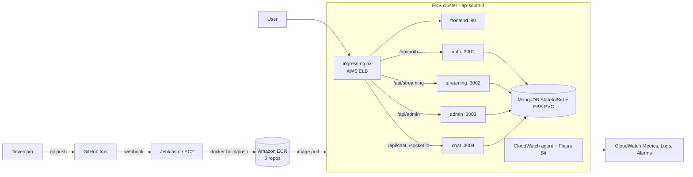

# StreamingApp on AWS EKS — Documentation

## Architecture

## Deployment steps
See the numbered runbook commands (cluster: `eks-cluster.yaml`, CI: `Jenkinsfile`, chart: `streamingapp/`).
Fill in: commands run, screenshots, config notes, production-hardening paragraph (namespaces, TLS, HPA).
